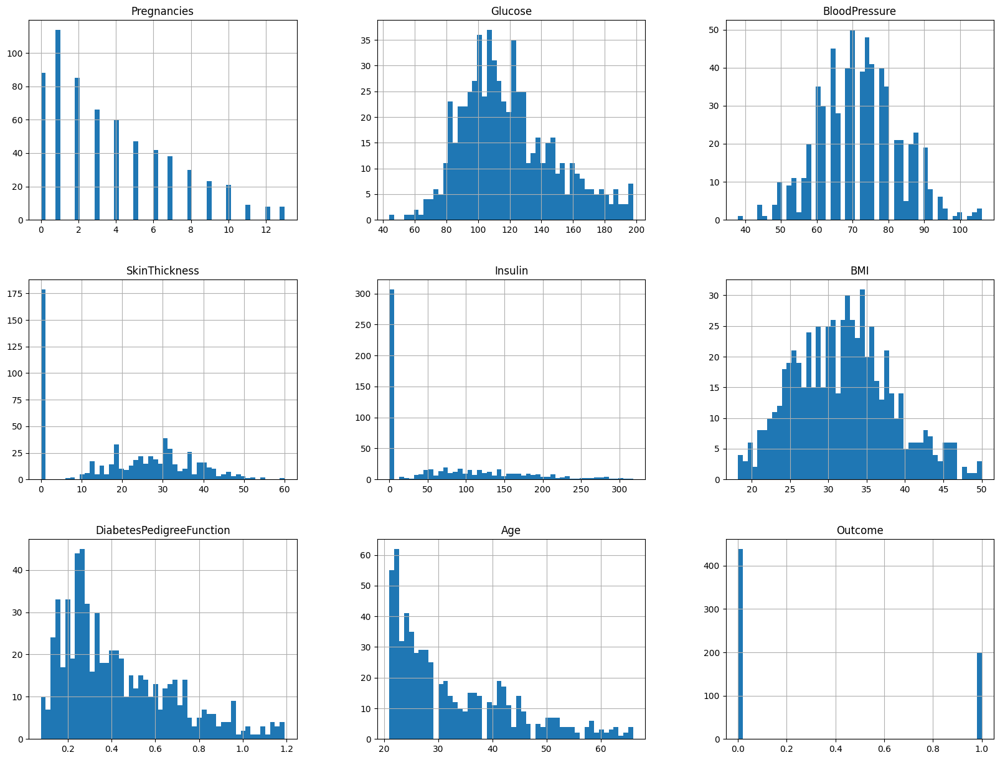

# **Laporan Proyek Machine Learning - Joko Prabowo**
## **Domain Proyek**
Diabetes Melitus (DM) adalah salah satu sindrom yang ditandai dengan kelainan pada metabolik yang terganggu  serta pada  kenaikan  konsentrasi  gula  darah  yang  abnormal  yang  disebabkan oleh defisiensi insulin, ataupun sensitivitas insulin yang rendah dari jaringan, maupun keduanya (Fadhillah et al., 2022). Penyakit ini timbul secara perlahan, sehingga seseorang tidak menyadari bahwa adanya berbagai macam perubahan pada dirinya. Perubahan seperti minum lebih banyak, buang air kecil menjadi lebih sering, berat badan terus menurun, dan berlangsung cukup lama, biasanya tidak diperhatikan, hingga baru di ketahui setelah kondisi menurun dan setelah dibawa ke rumah sakit lalu di periksa kadar glukosa darahnya (Riadi,. 2017). Jumlah penderita diabetes melitus di Indonesia tahun 2000 mencapai 8,43 juta jiwa dan diperkirakan mencapai 21,257 juta jiwa pada tahun 2030, Berdasarkan data Departemen Kesehatan (DepKes) angka prevalensi penderita diabetes di Indonesia pada tahun 2008 mencapai 5,7% dari jumlah penduduk Indonesia atau sekitar 12 juta jiwa (Amir et al., 2015). Oleh karenanya Diabetes Melitus merupakan penyakit yang cukup berbahaya dan perlu peninjauan lebih lanjut mengenai probabilitas penyakit ini di lingkungan masyarakat sekitar.

Di dunia teknologi saat ini teknologi telah melekat dalam kehidupan sehari-hari, teknologi telah mempermudah pekerjaan manusia di setiap bidang kehidupan termasuk kesehatan. Teknologi telah membawa banyak perubahan signifikan dalam dunia kesehatan, menciptakan peluang baru untuk meningkatkan kualitas hidup, mempercepat diagnosis, dan memperbaiki pengobatan. Semakin berkembangnya zaman, semakin berkembang pula teknologi untuk mengatasi permasalahan yang semakin mengusik di bidang kesehatan, dan *machine learning* merupakan salah satu teknologi terbaru yang mampu menyelesaikannya. *Machine learning* merupakan cabang dari kecerdasan buatan (*Artificial Intelligence*) dan ilmu komputer yang berfokus pada penggunaan data dan algoritma untuk meniru cara manusia belajar dan secara bertahap dapat meningkatkan akurasinya. Semakin  bagus  algoritma machine  learning yang digunakan maka akan semakin baik pula keputusan yang keluar (Faiza & Andriani., 2022). *Machine learning* telah membantu manusia dalam menyelesaikan berbagai macam masalah dalam bidang kesehatan. Oleh karenanya dalam proyek ini penulis ingin menggunakan *machine learning* untuk membuat program yang mampu mendeteksi probabilitas seseorang terkena diabetes

## **Business Understanding**
### **Problem Statements**
Berdasarkan latar belakang yang telah dipaparkan. Berikut adalah daftar permasalahan yang perlu diselesaikan dalam proyek ini:
<ul>
  <li>Seberapa besar persentase dari responden yang mengalami diabetes?</li>
  <li>Faktor apa saja yang sangat berpengaruh untuk meningkatkan kemungkinan diabetes?</li>
  <li>Model apa yang paling ampuh untuk memprediksi penderita diabetes?</li>
</ul>

### **Goals**
<ul>
  <li>Mengetahui total persentasi dari responden yang mengalami diabetes.</li>
  <li>Mengetahui faktor-faktor yang mempengaruhi seseorang menderita diabetes.</li>
  <li>Menemukan model yang paling ampuh untuk mendeteksi penderita diabetes.</li>
</ul>

### **Solution Statements**
<ul>
  <li>Melakukan analisis terhadap data responden untuk mengetahui persentase penderita diabetes dari seluruh responden yang ada.</li>
  <li>Melakukan analisis serta menerapkan fungsi visualisai untuk mengetahui faktor-faktor yang sangat mempengaruhi seseorang mengidap diabetes.</li>
  <li>Menerapkan model pada data yang ada serta membandingkan hasil prediksi antara setiap model untuk menemukan model terbaik.</li>
</ul>

## **Data Understanding**
Data yang digunakan dalam proyek ini merupakan data yang aslinya diperoleh dari *National Institute of Diabetes and Digestive and Kidney Diseases* yang kemudian dipublikasikan oleh Akshay Dattatray Khare. Data ini diambil dari pasien perempuan berumur minimal 21 tahun yang merupakan keturunan suku Indian Pima. Data ini memiliki lisensi *CC0: Public Domain* dengan *Usability score* 10.00. Dalam dataset ini memiliki beberapa fitur yang tersimpan kedalam beberapa variabel sebagai berikut:

  
Variabel|Keterangan
----------|----------
Pregnancies|Jumlah kehamilan
Glucose|Kadar glukosa dalam darah
BloodPressure|Tekanan darah
SkinThickness|Ketebalan kulit
Insulin|Kadar insulin dalam tubuh
BMI|Index massa tubuh
DiabetesPedigreeFunction|Presentase diabetes
Age|Umur
Outcome|Nilai akhir (positif = 1) dan (negatif = 0)

## **Exploratory Data Analysis**
### **Deskripsi Variabel**
Berdasarkan detail deskripsi dari data ditemukan bahwa:

  #|Column|Non-Null Count|Dtype
---|---|---|---
0|Pregnancies|768 non-null|int64
1|Glucose|768 non-null|int64
2|BloodPressure|768 non-null|int64
3|SkinThickness|768 non-null|int64
4|Insulin|768 non-null|int64
5|BMI|768 non-null|float64
6|DiabetesPedigreeFunction|768 non-null|float64
7|Age|768 non-null|int64
8|Outcome|768 non-null|int64

Dari tabel diatas dapat disimpulkan bahwa:
<ul>
  <li>Terdapat 6 data numerik dengan tipe data int64, yaitu: Pregnancies, Glucose, BloodPressure, SkinThickness, Insulin, dan Age,</li>
  <li>Terdapat 2 data numerik dengan tipe data float64, yaitu: BMI, dan DiabetesPedigreeFunction, serta</li>
  <li>Terdapat 1 data kategorik dengan tipe data int64, yaitu: Outcome yang merupakan target fitur dari proyek ini.</li>
</ul>

Kemudian melalui data deskripsi juga ditemukan informasi statistik dari setiap kolom diantaranya:
|	|Pregnancies|Glucose|BloodPressure|SkinThickness|Insulin|BMI|DiabetesPedigreeFunction|Age|Outcome|
 ---|---|---|---|---|---|---|---|---|---
count|768.000000|768.000000|768.000000|768.000000|768.000000|768.000000|768.000000|768.000000|768.000000
mean|3.845052|120.894531|69.105469|20.536458|79.799479|31.992578|0.471876|33.240885|0.348958
std|3.369578|31.972618|19.355807|15.952218|115.244002|7.884160|0.331329|11.760232|0.476951
min|0.000000|0.000000|0.000000|0.000000|0.000000|0.000000|0.078000|21.000000|0.000000
25%|1.000000|99.000000|62.000000|0.000000|0.000000|27.300000|0.243750|24.000000|0.000000
50%|3.000000|117.000000|72.000000|23.000000|30.500000|32.000000|0.372500|29.000000|0.000000
75%|6.000000|140.250000|80.000000|32.000000|127.250000|36.600000|0.626250|41.000000|1.000000
max|17.000000|199.000000|122.000000|99.000000|846.000000|67.100000|2.420000|81.000000|1.000000

Dimana:
<ul>
  <li>count merupakan jumlah sampel,</li>
  <li>mean merupakan nilai rata-rata,</li>
  <li>std merupakan standar deviasi,</li>
  <li>min merupakan nilai minimum,</li>
  <li>25% merupakan kuartil pertama,</li>
  <li>50% merupakan kuartil kedua,</li>
  <li>75% merupakan kuartil ketiga, dan</li>
  <li>max merupakan nilai maximum.</li>
</ul>

### **Unvariate analysis**
Untuk menjalankan proses ini, terlebih dahulu setiap fitur harus dibagi menjadi fitur numerik dan kategorik yang diantaranya:
<ul>
  <li>Fitur numerik: Pregnancies, Glucose, BloodPressure, SkinThickness, Insulin, BMI, DiabetesPedigreeFunction, dan Age</li>
  <li>Fitur kategorik: Outcome</li>
</ul>

Selanjutnya setiap fitur akan divisualisasikan ke dalam grafik agar lebih mudah di eksplorasi dimulai dengan fitur kategorik.

  

Berdasarkan gambar diatas, ditemukan bahwa mayoritas responden bukan merupakan penderita diabetes (outcome = 0). Dimana jika di persentasekan jumlah responden yang bukan penderita dan penderita diabetes adalah 68.7% dan 31.3%.

Kemudian dilanjut dengan visualisasi fitur numerik.

  

Berdasarkan histogram diatas dapat disimpulkan bahwa:
<ul>
  <li>Plot histogram SkinThickness dan Insulin tidak berdistribusi normal</li>
  <li>Plot histogram dari Glucose, BloodPressure, dan BMI cukup berdistribusi normal</li>
  <li>Plot histogram dari Pregnancies, DiabetesPedigreeFunction, dan Age berdistribusi cenderung miring ke kanan sehingga mayoritas data memiliki nilai dibawah rata-rata</li>
</ul>

### **Multivariate analysis**
Untuk menganalisis hubungan antara fitur target (Outcome) dengan fitur lainnya, fungsi stripplot() akan digunakan sebagai visualisasi antar hubungan tersebut pada proyek ini.

  
  
  
  
  
  
  
  

Berdasarkan visualisasi dari gambar-gambar diatas dapat disimpulkan bahwa:
<ul>
  <li>Tidak terdapat perbedaan yang mencolok antara fitur-fitur diatas dengan kemungkinan penderita diabetes</li>
  <li>Namun, dalam rentang kandungan glukosa di dalam tubuh orang pengidap diabetes berkisar 80 - 200 mg/dL dimana untuk yang bukan pengidap diabetes berkisar 40 - 180 mg/dL</li>
</ul>

Selanjutnya untuk melihat korelasi antar fitur numerik pada proyek ini, penulis akan menggunakan fungsi heatmap()

  

Dari heatmap diatas dapat terlihat bahwa:
<ul>
  <li>Umur punya korelasi yang cukup tinggi terhadap jumlah kehamilan, layaknya kadar insulin dalam tubuh terhadap ketebalan kulit</li>
  <li>Namun Umur punya korelasi yang sangat rendah terhadap kadar insulin dalam tubuh, layaknya jumlah kehamilan terhadap ketebalan kulit</li>
</ul>

## **Data Preparation**
Proses ini dilakukan melalui beberapa tahap yang meliputi:
<ul>
  <li>Menangani missing value dan outliners</li>
  <li>Pembagian data latih dan uji, dan</li>
  <li>Standarisasi</li>
</ul>

### **Menangani missing value dan outliners**
Sebelum data diproses lebih lanjut, data terlebih dahulu akan dibersihkan dari data yang mengandung nilai kosong, data terduplikat, serta data dengan nilai yang menyimpang (outliners). Hal ini dilakukan agar data-data tidak lengkap tersebut tidak menggangu dalam pengimplementasian model nanti.

Setelah melakukan proses pengecekan mengenai data kosong dan terduplikasi, ternyata data-data tersebut tidak ditemukan dalam dataset di proyek ini sehingga proses akan langsung dilanjutkan untuk menangani data dengan nilai menyimpang (Outliners).

  
  
  
  
  
  
  
  

Berdasarkan data visual diatas dapat disimpulkan bahwa setiap fitur memiliki data outliners atau data yang memiliki nilai menyimpang pada umumnya sehingga harus dihapus. Dalam proyek ini penulis menggunakan IQR Method untuk menghapus data outliners. Setelah dilakukan proses penghapusan data outliners, ditemukan bahwa ada 129 data outliners dalam dataset di proyek ini. Setelah dihapus maka proses dapat dilanjutkan.

### **Pembagian data latih dan uji**
Proses ini akan membagi data yang ada menjadi data latih dan data uji dengan rasio pembagian sebesar 80% untuk data latih dan 20% untuk data uji. Data latih digunakan untuk melatih model yang akan dibuat agar model terbiasa dengan data yang tersedia, yang kemudian model tersebut akan diuji menggunakan data uji untuk mengetahui seberapa efektif model tersebut. Dari total data yang dimiliki di proyek ini (639 data), yang mana 80% dari total data (511 data) menjadi data latih, dan 20% dari total data (128 data) menjadi data uji.

### **Standarisasi**
Untuk mempersiapkan fitur numerik agar dapat diproses dengan baik, setiap fitur numerik harus melewati proses standarisasi terlebih dahulu. Hal ini diperlukan untuk menghindari kebocoran informasi serta memudahkan model untuk memproses informasi yang masuk melalui data yang digunakan. Saat ini fitur standarisasi hanya akan dilakukan pada data latih karena standarisasi pada data uji hanya akan dilakukan setelah melalui proses evaluasi.

| |Pregnancies|Glucose|BloodPressure|SkinThickness|Insulin|BMI|DiabetesPedigreeFunction|Age|
|---|---|---|---|---|---|---|---|---|
count|511.000|511.000|511.000|511.000|511.000|511.000|511.000|511.000
mean|-0.000|-0.000|-0.000|-0.000|0.000|0.000|0.000|-0.000
std|1.001|1.001|1.001|1.001|1.001|1.001|1.001|1.001
min|-1.186|-2.607|-3.027|-1.344|-0.837|-2.135|-1.404|-1.071
25%|-0.879|-0.715|-0.744|1.344|-0.837|-0.736|-0.766|-0.803
50%|-0.266|-0.165|-0.042|0.150|-0.343|-0.013|-0.272|-0.357
75%|0.653|0.626|0.660|0.734|0.709|0.632|0.626|0.626
max|2.799|2.689|2.943|2.163|3.096|2.754|3.027|2.947

Seperti tabel yang terlihat diatas, setelah melewati proses standarisasi nilai rata-rata(mean) dan standar deviasi(std) dari setiap fitur akan berubah menjadi 0 dan 1. Dengan ini proses bisa dilanjutkan.

## **Model Development**
Dalam proyek ini model yang digunakan untuk mengolah data dan membuat prediksi terhadap data diantaranya:
<ul>
  <li>K-Nearest Neighbour</li>
  <li>Random Forest</li>
  <li>Adaptive Boosting</li>
  <li>Support Vector Machine</li>
  <li>Decision Tree Regression</li>
</ul>

### **K-Nearest Neighbour**
Algoritme KNN bekerja dengan menemukan K tetangga terdekat ke titik data tertentu berdasarkan metrik jarak, seperti jarak Euclidean. Kelas atau nilai titik data kemudian ditentukan oleh suara mayoritas atau rata-rata K tetangga. Pendekatan ini memungkinkan algoritme untuk beradaptasi dengan pola yang berbeda dan membuat prediksi berdasarkan struktur lokal data.

Model KNN yang digunakan dalam proyek ini menggunakan fungsi KNeighborsRegressor dari modul sklearn.neighbors, melalui fungsi ini model akan dilatih dan diuji menggunakan data latih dan uji yang tersedia dengan beberapa parameter tambahan. Mulai dari n_neighbors yang merupakan jumlah tetangga, leaf_size yang berarti ukuran daun, dan p yang berarti kekuatan parameter.

### **Random Forest**
Random Forest bekerja dengan membangun beberapa decision tree dan menggabungkannya demi mendapatkan prediksi yang lebih stabil dan akurat. ‘Hutan’ yang dibangun oleh Random Forest adalah kumpulan decision tree di mana biasanya dilatih dengan metode bagging. Ide umum dari metode bagging adalah kombinasi model pembelajaran untuk meningkatkan hasil keseluruhan.

Model Random Forest yang digunakan dalam proyek ini menggunakan fungsi RandomForestRegressor dari modul sklearn.ensemble, melalui fungsi ini model akan dilatih dan diuji menggunakan data latih dan uji yang tersedia dengan beberapa parameter tambahan. Mulai dari n_estimators yang artinya jumlah pohon di dalam hutan, max_depth yang berarti kedalaman maksimum dari pohon, dan leaf_size yang berarti ukuran daun.

### **Adaptive Boosting**
AdaBoost awalnya memberikan bobot yang sama untuk setiap set data. Kemudian, secara otomatis menyesuaikan bobot titik data setelah setiap pohon keputusan. AdaBoost memberikan bobot lebih pada item dengan klasifikasi yang salah agar diperbaiki di putaran berikutnya. AdaBoost mengulangi proses tersebut hingga kesalahan yang tersisa, atau selisih antara nilai aktual dan prediksi, jatuh di bawah ambang batas yang dapat diterima.

Model Adaptive Boosting yang digunakan dalam proyek ini menggunakan fungsi AdaBoostRegressor dari modul sklearn.ensemble, melalui fungsi ini model akan dilatih dan diuji menggunakan data latih dan uji yang tersedia dengan beberapa parameter tambahan. Mulai dari n_estimator yaitu jumlah penaksir dimana peningkatan dihentikan, learning_rate yaitu kecepatan pembelajaran, dan random_state yaitu benih acak yang digunakan dalam proses.

### **Support Vector Machine**
SVM bekerja dengan memetakan data ke ruang fitur berdimensi tinggi sehingga titik data dapat dikategorikan, bahkan ketika data tidak dapat dipisahkan secara linier. Ditemukan pemisah antar kategori, kemudian data ditransformasikan sedemikian rupa sehingga pemisah tersebut dapat digambarkan sebagai hyperplane. Setelah itu, karakteristik data baru dapat digunakan untuk memprediksi kelompok mana yang seharusnya menjadi bagian dari data baru.

Model SVM yang digunakan dalam proyek ini menggunakan fungsi SVR dari modul sklearn.svm, melalui fungsi ini model akan dilatih dan diuji menggunakan data latih dan uji yang tersedia dengan beberapa parameter tambahan. Mulai dari gamma yang merupakan kernel koefisien, dan verbose yang mengatur pengaturan runtime dalam proses.

### **Decission Tree Regression**
Untuk memprediksi kelas dari dataset yang diberikan, algoritma Decision tree dimulai dari simpul akar pohon. Algoritma ini membandingkan nilai atribut root dengan atribut record. Berdasarkan perbandingan tersebut, algoritma menelusuri cabang dan menuju ke simpul berikutnya. Untuk simpul berikutnya, algoritma kembali membandingkan nilai atribut dengan sub-simpul lainnya dan bergerak menuju simpul yang lebih dalam. Tujuannya untuk melanjutkan proses sampai mencapai simpul daun (node leaf). 

Model Decission Tree yang digunakan dalam proyek ini menggunakan fungsi DecisionTreeRegressor dari modul sklearn.tree, melalui fungsi ini model akan dilatih dan diuji menggunakan data latih dan uji yang tersedia dengan beberapa parameter tambahan. Mulai dari min_samples_leaf yang merupakan jumlah minimum sampel yang diperlukan untuk berada pada simpul daun, min_samples_split yang merupakan jumlah minimum sampel yang diperlukan untuk memisahkan node internal, max_depth yang merupakan kedalaman maksimum dari pohon, max_features yang merupakan jumlah fitur yang perlu dipertimbangkan saat mencari pemisahan terbaik, dan random_state yang melakukan kontrol terhadap penafsir acak.

## **Evaluasi Model**
Metrik yang digunakan dalam proses evaluasi ini yaitu:
*   Akurasi (Accuracy) merupakan proporsi data yang berhasil diprediksi dengan benar dari seluruh data yang diprediksi.

  

*   Presisi (Precision) merupakan proporsi data positif yang berhasil diprediksi dengan benar dari seluruh data yang diprediksi positif.
*   Sensitivitas (Recall) merupakan proporsi data positif yang berhasil diprediksi dengan benar dari seluruh data yang aslinya positif.
*   skor f1 (F1 Score) merupakan rata-rata harmonik dari precision dan recall untuk mendapatkan sebuah metrik yang seimbang.

Namun sebelum melakukan evaluasi, perlu dilakukan scaling pada fitur numerik dalam data uji seperti halnya yang telah dilakukan pada data latih sebelumnya. Hal ini dilakukan agar skala nilai antar keduanya serupa.

Kemudian dilanjutkan dengan melakukan evaluasi terhadap setiap model yang telah dibuat, yang setelahnya muat setiap metrik ke dalam tabel dan visualisasikan ke dalam chart.

|	|Accuracy|Precision|Recall|F1-score|Support|
---|---|---|---|---|---
KNN|0.796875|0.75|0.416667|0.535714|128
RandomForest|0.804688|0.689655|0.555556|0.615385|128
Boosting|0.84375|0.863636|0.527778|0.655172|128
SVM	0.804688|0.761905|0.444444|0.561404|128
DecisionTree|0.71875|0.0|0.0	0.0|128

Berdasarkan tabel dan gambar diatas, setiap model menghasilkan skor metrik yang bervariasi. Namun jika diperhatikan lebih detail, hasil skor metrik dari setiap model tidak terpaut terlalu jauh. Dan dari gambar di atas dapat diambil kesimpulan bahwa model yang menghasilkan skor akurasi terendah adalah model Decision Tree dengan akurasi 71.88% dan skor akurasi tertinggi adalah model Adaptive Boosting dengan akurasi 84.38%

## **Kesimpulan**
Berdasarkan hasil yang telah diperolah dari setiap proses yang dilakukan dalam proyek ini dapat disimpulkan bahwa:
<ul>
  <li>Dari total responden yang datanya digunakan dalam proyek ini, sebesar 68.7% responden bukan merupakan penderita diabetes dan 31.3% sisanya merupakan penderita diabetes,</li>
  <li>Faktor terkuat yang mempengaruhi seseorang akan mengidap diabetes adalah kadar glukosa, kadar insulin dan umur, serta</li>
  <li>Dari 5 model yang digunakan dalam proyek ini yaitu K-Nearest Neighbour, Random Forest, Adaptive Boosting, Support Vector Machine, dan Decision Tree Regression. Model Adaptive Boosting merupakan model yang mengasilkan skor akurasi terbesar yaitu sebesar 84.38%.</li>
</ul>

## **Referensi**
Fadhillah, R. P., Rahma, R., Sepharni, A., Mufidah, R., Sari, B. N., & Pangestu, A. (2022). Klasifikasi Penyakit Diabetes Mellitus Berdasarkan Faktor-Faktor Penyebab Diabetes menggunakan Algoritma C4. 5. JIPI (Jurnal Ilmiah Penelitian dan Pembelajaran Informatika), 7(4), 1265-1270.

Riadi, A. (2017). Penerapan Metode Certainty Factor Untuk Sistem Pakar Diagnosa Penyakit Diabetes Melitus Pada Rsud Bumi Panua Kabupaten Pohuwato. ILKOM Jurnal Ilmiah, 9(3), 309-316.

Amir, S. M., Wungouw, H., & Pangemanan, D. (2015). Kadar glukosa darah sewaktu pada pasien diabetes melitus tipe 2 di Puskesmas Bahu kota Manado. eBiomedik, 3(1).

Faiza, I. M., & Andriani, W. (2022). Tinjauan Pustaka Sistematis: Penerapan Metode Machine Learning untuk Deteksi Bencana Banjir. Jurnal Minfo Polgan, 11(2), 59-63.
